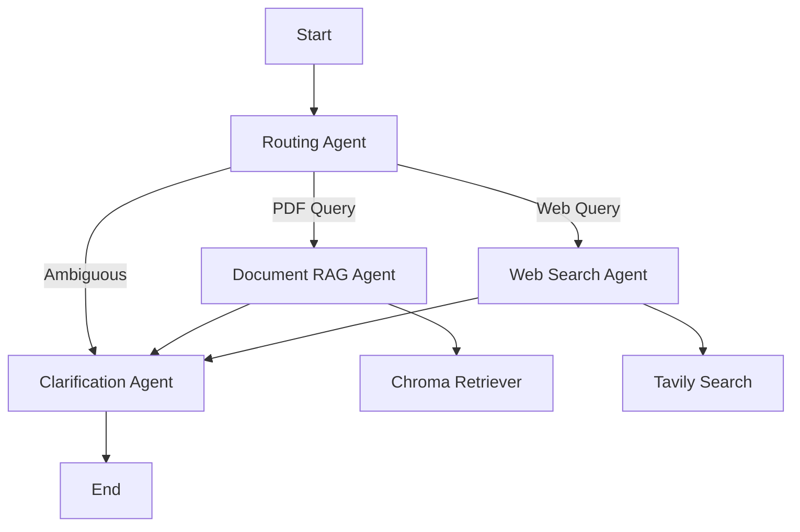

# Chat With PDF - Multi-Agent RAG System

This project is an intelligent question-answering system that combines PDF document retrieval with web search, using a multi-agent architecture built on LangGraph. It is designed for any person who want to query both local documents and the web through a single API. This work was created as part of an assignment project for Arcfusion.

---

## System Architecture

The system uses several specialized agents:

- **Routing Agent**: Analyzes incoming queries and decides whether to use document retrieval, web search, or clarification.
- **Document RAG Agent**: Answers questions using ingested PDF documents and a Chroma vector store.
- **Web Search Agent**: Handles queries that require up-to-date information from the web using the Tavily API.
- **Clarification Agent**: Asks follow-up questions if a query is ambiguous or incomplete.

### Architecture Diagram



---

## Quick Start (Docker)

1. **Clone the repository**
   ```sh
   git clone <repository-url>
   cd arc-chatpdf
   ```
2. **Set up environment variables**
   - Copy `.env.example` to `.env` and fill in your OpenAI and Tavily API keys.
3. **Add PDF files**
   - Place your PDF files in the `data/` directory.
4. **Build and run**
   ```sh
   docker-compose up --build
   ```
   - The API will be available at http://localhost:8000

---

## API Usage Examples

- **Ask a question:**
  ```sh
  curl -X POST http://localhost:8000/query \
    -H "Content-Type: application/json" \
    -d '{"query": "What is the highest zero-shot accuracy on Spider dataset?", "session_id": null}'
  ```
- **Continue a conversation:**
  ```sh
  curl -X POST http://localhost:8000/query \
    -H "Content-Type: application/json" \
    -d '{"query": "What about few-shot results?", "session_id": "previous-session-id-here"}'
  ```
- **Health check:**
  ```sh
  curl http://localhost:8000/health
  ```

---

## Project Structure

- `agents.py` — Multi-agent logic and state management
- `main.py` — LangGraph configuration
- `app.py` — FastAPI application
- `ingest_pdfs.py` — PDF ingestion script
- `data/` — PDF storage directory
- `chroma_langchain_db/` — Vector store persistence

---

## Trade-offs

- **Simplicity vs. Flexibility:** The multi-agent design is flexible and easy to extend, but adds some complexity compared to a single-agent or monolithic approach.
- **Dependency on External APIs:** The system relies on OpenAI and Tavily APIs, which require keys and may incur costs.
- **Cold Start for Ingestion:** PDF ingestion happens at container startup if PDFs are present, which can delay the first API response after deployment.
- **Resource Usage:** Running vector search and web search in the same service can increase memory and CPU usage, especially with large document sets.

---

## Next Steps

- **Add automated tests and CI/CD integration.**
- **Implement authentication and rate limiting for production deployments.**
- **Improve error handling and logging for better observability.**
- **Support for more file types (e.g., images, tables) and additional retrieval strategies.**
- **Enable distributed processing for scaling to larger workloads.**

---

## Troubleshooting

- **PDFs not ingested?** Ensure they are in the `data/` directory and readable by the container.
- **API not starting?** Check Docker logs and verify your environment variables are set correctly.
- **Vector store errors?** Try removing the `chroma_langchain_db/` directory and restarting.

---

## License

[Add your license here]

---

## Acknowledgments

- Built with LangChain, LangGraph, OpenAI, Tavily, and Chroma.