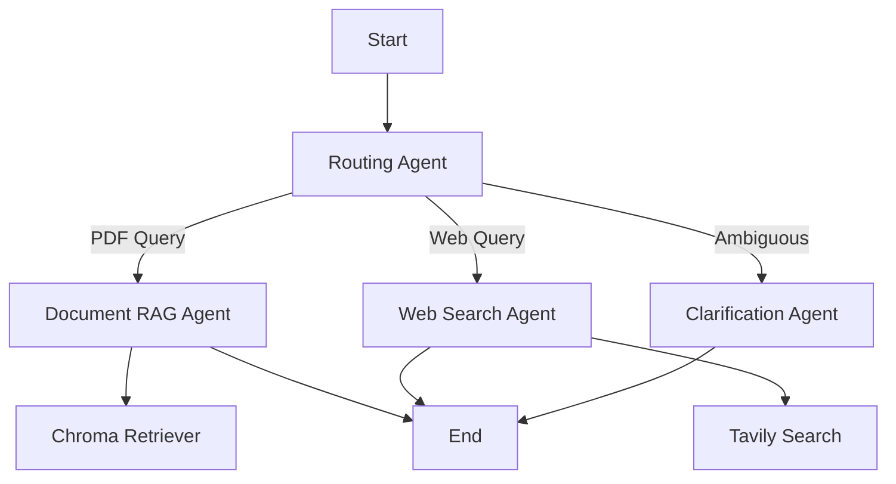

# Chat With PDF - Multi-Agent RAG System

A comprehensive question-answering system that combines PDF document retrieval with web search capabilities using a multi-agent architecture built on LangGraph. This system allows users to query both local documents and the web through a single API interface. Originally developed as an assignment project for Arcfusion.

## Overview

The system intelligently routes user queries to the most appropriate processing path: document retrieval for PDF-based questions, web search for current information, or clarification for ambiguous queries. It maintains conversation context across multiple interactions and provides detailed evaluation metrics for performance assessment.

## System Architecture

The system employs several specialized agents working together:

- **Routing Agent**: Analyzes incoming queries and determines the optimal processing path
- **Document RAG Agent**: Handles questions requiring information from ingested PDF documents using Chroma vector store
- **Web Search Agent**: Processes queries needing current information via Tavily API
- **Clarification Agent**: Manages ambiguous or incomplete queries by requesting additional context

### Architecture Flow



## Quick Start

### Local Development

1. **Clone and setup**
   ```bash
   git clone <repository-url>
   cd arc-chatpdf
   ```

2. **Install dependencies**
   ```bash
   pip install -r requirements.txt
   ```

3. **Configure environment**
   ```bash
   cp .env.example .env
   # Edit .env with your API keys
   ```

4. **Add PDF documents**
   - Place PDF files in the `data/` directory

5. **Ingest documents**
   ```bash
   python ingest_pdfs.py --pdf-dir data/
   ```

6. **Start the application**
   ```bash
   python app.py
   ```

### Docker Deployment

1. **Prepare environment**
   ```bash
   cp .env.example .env
   # Add your API keys to .env
   ```

2. **Add PDF files**
   - Place PDF files in the `data/` directory

3. **Build and run**
   ```bash
   docker-compose up --build
   ```

4. **Verify deployment**
   ```bash
   curl http://localhost:8000/health
   ```

## API Reference

### Endpoints

- `POST /query` - Submit questions and receive answers
- `DELETE /session/{session_id}` - Clear conversation history
- `GET /session/{session_id}` - Get session information
- `GET /health` - System health check
- `POST /evaluate` - Run evaluation with golden Q&A pairs
- `POST /debug/routing` - Debug query routing decisions

### Usage Examples

**Basic question**
```bash
curl -X POST http://localhost:8000/query \
  -H "Content-Type: application/json" \
  -d '{"query": "What is the highest zero-shot accuracy on Spider dataset?"}'
```

**Conversation continuation**
```bash
curl -X POST http://localhost:8000/query \
  -H "Content-Type: application/json" \
  -d '{"query": "What about few-shot results?", "session_id": "previous-session-id"}'
```

**Clear session**
```bash
curl -X DELETE http://localhost:8000/session/{session_id}
```

**Run evaluation**
```bash
curl -X POST http://localhost:8000/evaluate
```

## Evaluation System

The system includes a comprehensive evaluation framework using golden Q&A pairs to measure performance across different question types and difficulty levels.

### Evaluation Metrics

- **Success Rate**: Percentage of questions answered successfully
- **Average Score**: Overall performance score (0.0 to 1.0)
- **Keyword Accuracy**: Percentage of expected keywords found in answers
- **Category Performance**: Breakdown by question type (performance_metrics, methodology, etc.)
- **Difficulty Performance**: Breakdown by complexity level (easy, medium, hard)

### Running Evaluations

**Command line**
```bash
python run_evaluation.py
```

**API endpoint**
```bash
curl -X POST http://localhost:8000/evaluate
```

**Programmatic**
```python
from evaluation import EvaluationSystem
evaluator = EvaluationSystem()
evaluator.load_golden_qa_from_file("golden_qa_pairs.json")
results = await evaluator.run_evaluation(run_query)
```

## Project Structure

```
arc-chatpdf/
├── agents.py              # Multi-agent logic and state management
├── main.py                # LangGraph configuration and core functions
├── app.py                 # FastAPI application and endpoints
├── ingest_pdfs.py         # PDF ingestion and processing
├── evaluation.py          # Evaluation system implementation
├── run_evaluation.py      # Evaluation runner script
├── golden_qa_pairs.json   # Sample evaluation questions
├── data/                  # PDF document storage
├── chroma_langchain_db/   # Vector store persistence
├── Dockerfile             # Container configuration
├── docker-compose.yml     # Service orchestration
└── pyproject.toml         # Project dependencies
```

## Configuration

### Environment Variables

- `OPENAI_API_KEY` - OpenAI API key for language model access
- `TAVILY_API_KEY` - Tavily API key for web search
- `LANGSMITH_TRACING` - Enable LangSmith tracing (optional)
- `LANGSMITH_API_KEY` - LangSmith API key (optional)
- `LANGSMITH_PROJECT` - LangSmith project name (optional)

### LangSmith Integration

For enhanced observability and debugging, configure LangSmith tracing:

```bash
LANGSMITH_TRACING=true
LANGSMITH_API_KEY=your-langsmith-key
LANGSMITH_PROJECT=arc-chatpdf
```

## Performance Considerations

### Document Retrieval

- **Chunking Strategy**: Documents are split into 1000-character chunks with 200-character overlap
- **Vector Search**: Uses OpenAI text-embedding-3-small for embeddings
- **Retrieval Parameters**: Fetches top 15 most relevant documents
- **Deduplication**: Removes duplicate content before processing

### Conversation Context

- **Session Management**: Maintains conversation history across multiple queries
- **Context Window**: Uses last 3 messages for conversation context
- **Follow-up Support**: Understands references to previous questions

## Troubleshooting

### Common Issues

**PDF ingestion problems**
- Ensure PDFs are in the `data/` directory
- Check file permissions and readability
- Verify PDF format compatibility

**API connection errors**
- Verify environment variables are set correctly
- Check API key validity and quotas
- Ensure network connectivity

**Vector store issues**
- Remove `chroma_langchain_db/` directory to reset
- Check disk space availability
- Verify Chroma service is running

**Poor document retrieval**
- Review chunking parameters in `ingest_pdfs.py`
- Check document quality and formatting
- Consider adjusting retrieval parameters

### Debug Tools

**Query routing debug**
```bash
curl -X POST http://localhost:8000/debug/routing \
  -H "Content-Type: application/json" \
  -d '{"query": "Your test question"}'
```

**Health check**
```bash
curl http://localhost:8000/health
```

## Development

### Adding New Agents

1. Define agent function in `agents.py`
2. Add node to graph in `main.py`
3. Update routing logic as needed
4. Add tests and documentation

### Extending Evaluation

1. Add new Q&A pairs to `golden_qa_pairs.json`
2. Define appropriate categories and difficulty levels
3. Include specific keywords for evaluation
4. Run evaluation to measure impact

### Customizing Retrieval

- Modify chunking parameters in `ingest_pdfs.py`
- Adjust retrieval parameters in `main.py`
- Implement custom reranking logic
- Add new document processing pipelines

## Limitations and Trade-offs

### Current Limitations

- **Single-threaded processing**: Queries are processed sequentially
- **Memory constraints**: Large document sets may require significant RAM
- **API dependencies**: Relies on external services for core functionality
- **Cold start latency**: Initial document ingestion can be slow

### Design Trade-offs

- **Simplicity vs. Performance**: Current design prioritizes clarity over optimization
- **Accuracy vs. Speed**: More comprehensive retrieval may increase response time
- **Flexibility vs. Complexity**: Multi-agent design adds complexity but enables extensibility

## Future Enhancements

### Planned Improvements

- **Distributed processing**: Support for parallel query processing
- **Advanced caching**: Implement intelligent result caching
- **Multi-modal support**: Extend to images, tables, and other content types
- **Authentication**: Add user management and access controls
- **Performance monitoring**: Real-time metrics and alerting

### Research Directions

- **Semantic similarity**: Implement more sophisticated text matching
- **Query optimization**: Advanced query expansion and reformulation
- **Context management**: Improved conversation memory and context handling
- **Evaluation metrics**: Enhanced scoring algorithms and benchmarks

## License

[Add your license information here]

## Acknowledgments

This project builds upon several open-source technologies and frameworks:

- **LangChain & LangGraph**: Multi-agent orchestration and workflow management
- **OpenAI**: Language model capabilities and embeddings
- **Tavily**: Web search and information retrieval
- **Chroma**: Vector database and similarity search
- **FastAPI**: High-performance web framework
- **Docker**: Containerization and deployment